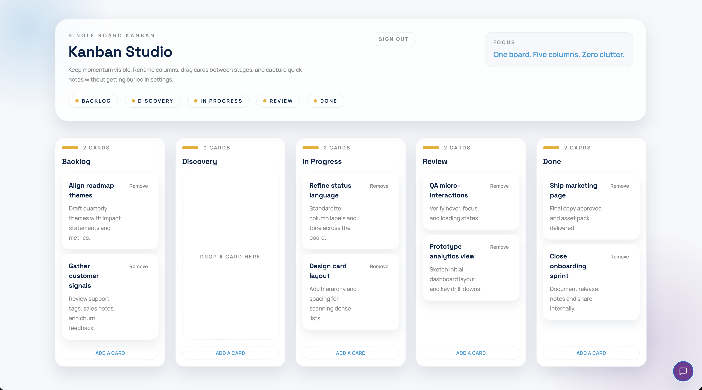
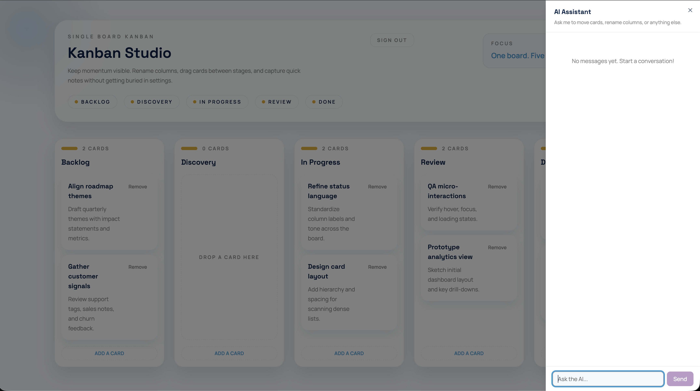

# Agentic PM

A focused, single-board Kanban app with an AI assistant that can read and update your board mid-conversation. One Docker command to run. No accounts, no SaaS, no noise.



Ask the AI to reorganize cards, rename columns, or summarize what's in progress — and it updates the board in real time.



---

## What it does

- **Kanban board** — five columns, unlimited cards, drag-and-drop reordering across columns. Rename any column inline.
- **AI chat sidebar** — a collapsible panel backed by OpenRouter. The AI receives the full board state with every message, so it understands context without you having to repeat yourself. When the AI decides to move or edit cards, the board updates live without a page reload.
- **Persistent state** — board data is stored in SQLite. Changes survive restarts.
- **Single container** — the Next.js static export is bundled into the same Docker image as the FastAPI backend. One port, no reverse proxy needed.

---

## Stack

| Layer         | Technology                                                   |
| ------------- | ------------------------------------------------------------ |
| Frontend      | Next.js 16 (static export), React, Tailwind CSS 4, shadcn/ui |
| Drag-and-drop | @dnd-kit/core                                                |
| Client state  | Zustand                                                      |
| Server state  | TanStack Query                                               |
| Backend       | Python FastAPI                                               |
| Database      | SQLite via SQLAlchemy async                                  |
| AI            | OpenRouter (`openai/gpt-oss-120b`)                           |
| Container     | Docker (single image, port 8000)                             |

---

## Prerequisites

- Docker (or Podman)
- An `OPENROUTER_API_KEY` in a `.env` file at the project root

```bash
echo "OPENROUTER_API_KEY=sk-..." > .env
```

---

## Running

```bash
# Build and start
./scripts/start.sh

# Stop and remove the container
./scripts/stop.sh
```

The app runs at `http://localhost:8000`. Sign in with `user` / `password`.

The scripts auto-detect `docker` or `podman`. Override with:

```bash
CONTAINER_RUNTIME=podman ./scripts/start.sh
```

---

## Development

Run the frontend dev server independently (no backend required — API calls are mocked in tests):

```bash
cd frontend
bun install
bun run dev        # http://localhost:3000
bun run test       # unit + component tests (Vitest)
bun run test:e2e   # Playwright e2e tests
```

Run the backend independently:

```bash
cd backend
uv sync
uv run uvicorn app.main:app --reload   # http://localhost:8000
uv run pytest
```

See `frontend/CLAUDE.md` and `backend/CLAUDE.md` for full command references.

---

## Project structure

```
frontend/    Next.js app (static export)
backend/     FastAPI app (serves frontend + REST API)
scripts/     start.sh / stop.sh
docs/        Architecture and planning documents
Dockerfile   Two-stage build: bun (frontend) + Python (backend)
```
