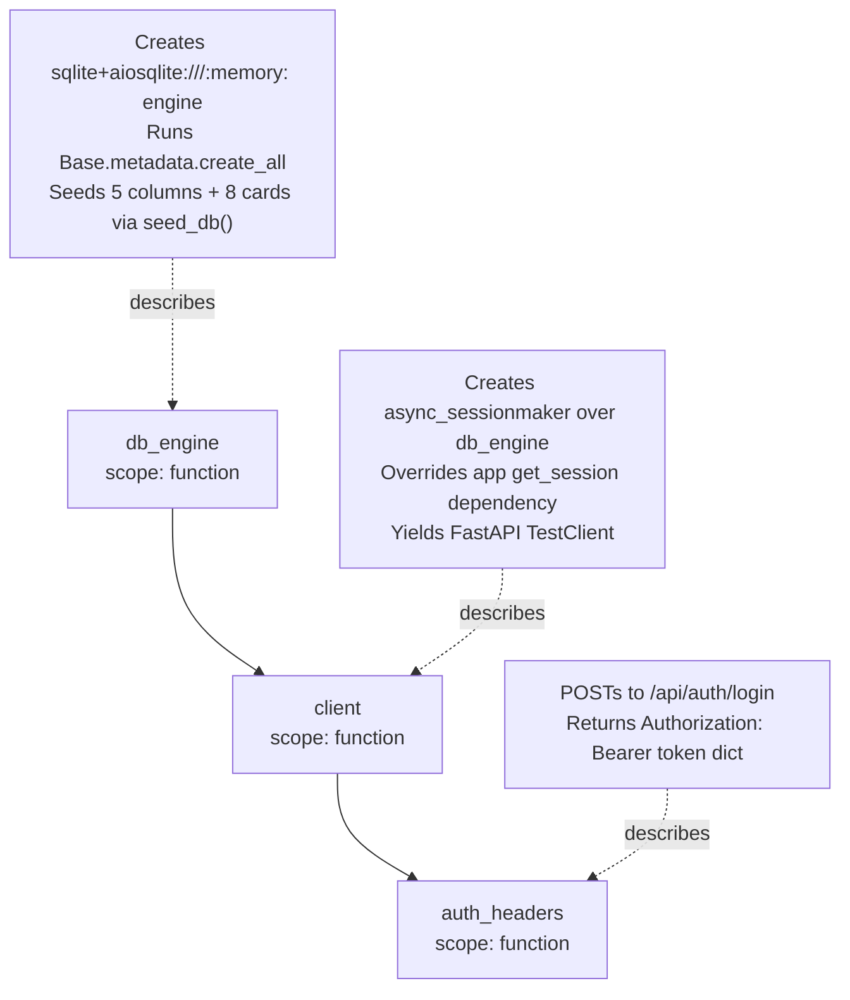
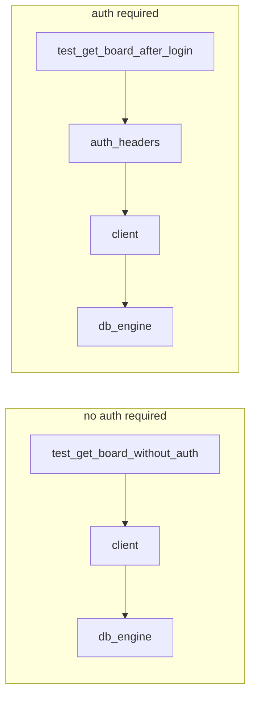
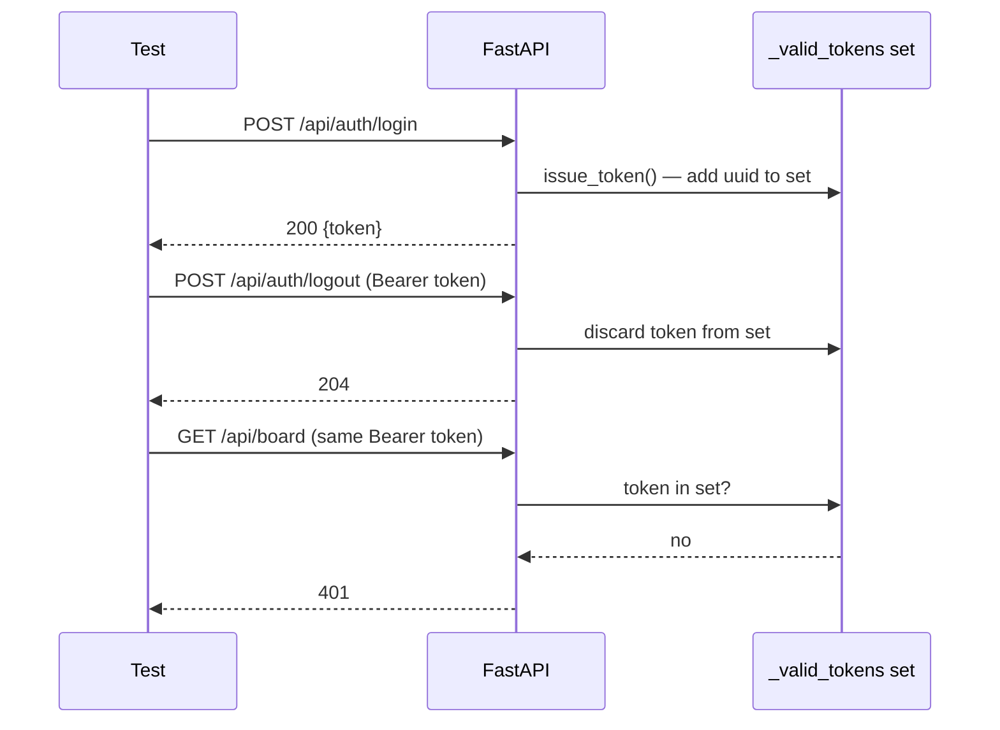
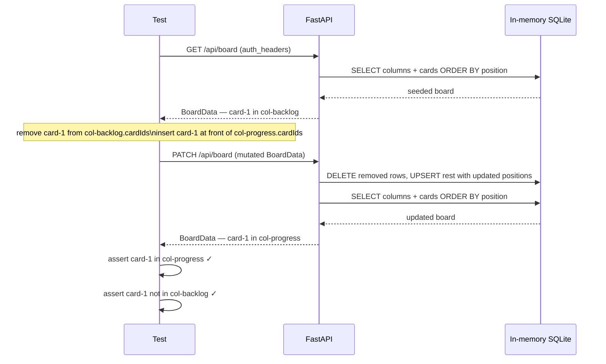
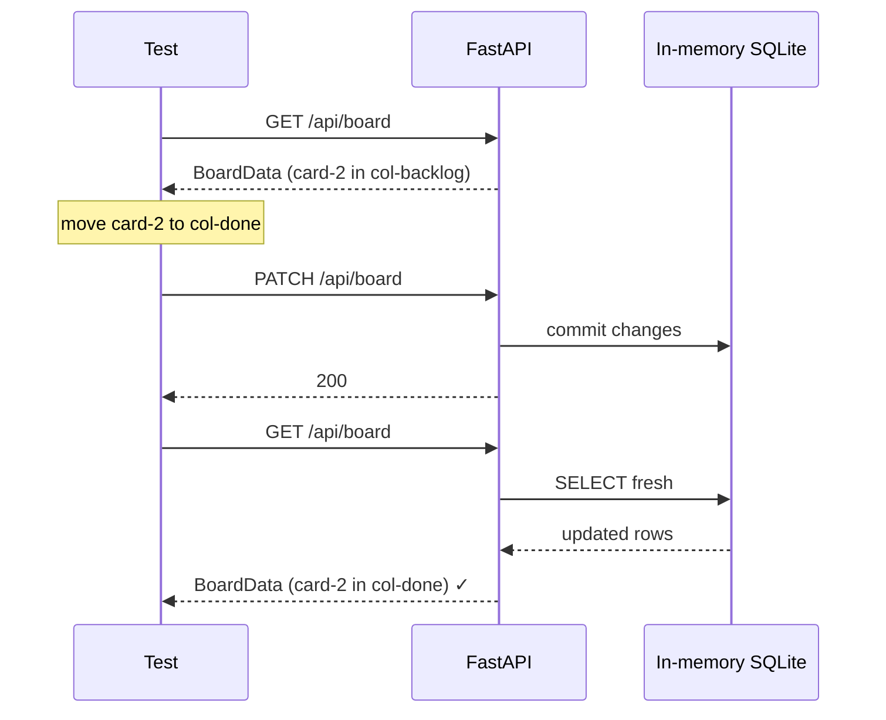

# Backend Integration Tests

## Overview

The backend uses `pytest` with FastAPI's synchronous `TestClient`. Each test gets an isolated, fully-seeded **in-memory SQLite database** — no file is written to disk and no state leaks between tests.

Run all tests:

```bash
uv run pytest
uv run pytest tests/routes/test_board.py   # single file
```

---

## Fixture Stack

Every test depends on a chain of three fixtures defined in `tests/conftest.py`:



### `db_engine`

Creates a fresh in-memory SQLite engine, applies the full schema via `Base.metadata.create_all`, then calls `seed_db()` to insert the same 5 columns and 8 cards used in the frontend's `initialData`.

Teardown calls `engine.dispose()` to release the in-memory database. Because `scope="function"`, every test gets a completely fresh database.

### `client`

Wraps the FastAPI `app` in a `TestClient` and **overrides the `get_session` dependency** to point at the in-memory engine instead of the real `board.db`. This means all route handlers — board reads, writes, auth — hit the isolated test database.

### `auth_headers`

Calls `POST /api/auth/login` through the test client and returns the `Authorization: Bearer <token>` header dict, ready to pass to any protected route.

---

## Fixture Dependency per Test



Tests that verify 401 behaviour only request `client`. Tests that exercise protected routes also request `auth_headers`, which depends on `client` which depends on `db_engine`.

---

## Test Files

### `tests/routes/test_auth.py`

Covers the login/logout lifecycle and `require_auth` enforcement.

| Test                                        | What it proves                                                      |
| ------------------------------------------- | ------------------------------------------------------------------- |
| `test_valid_login`                          | `POST /api/auth/login` with correct credentials returns 200 + token |
| `test_wrong_password`                       | Wrong password → 401                                                |
| `test_wrong_username`                       | Unknown username → 401                                              |
| `test_no_auth_header`                       | Missing `Authorization` header → 401                                |
| `test_invalid_token`                        | `Bearer invalid-token` → 401                                        |
| `test_malformed_auth_header`                | `Token abc` (wrong scheme) → 401                                    |
| `test_valid_token_accesses_protected_route` | Valid token → 200 on `GET /api/board`                               |
| `test_logout`                               | `POST /api/auth/logout` → 204; same token on next request → 401     |
| `test_logout_requires_auth`                 | `POST /api/auth/logout` without token → 401                         |

Token lifecycle within `test_logout`:



---

### `tests/routes/test_board.py`

Covers the full CRUD surface of `GET /api/board` and `PATCH /api/board`.

| Test                            | What it proves                                                                 |
| ------------------------------- | ------------------------------------------------------------------------------ |
| `test_get_board_without_auth`   | `GET /api/board` with no token → 401                                           |
| `test_get_board_after_login`    | Returns seeded board: 5 columns, 8 cards                                       |
| `test_patch_board_move_card`    | Moving `card-1` from Backlog to In Progress is reflected in the PATCH response |
| `test_get_board_reflects_patch` | After a PATCH, a subsequent GET returns the mutated state                      |
| `test_patch_board_add_column`   | Sending a board with a new column inserts it and returns it                    |
| `test_patch_board_delete_card`  | Sending a board with `card-8` removed deletes it from the DB                   |
| `test_patch_board_without_auth` | `PATCH /api/board` with no token → 401                                         |

The move-card test in detail:



The persistence test (`test_get_board_reflects_patch`) issues two separate requests against the same test client — a PATCH followed by a GET — confirming that `board_to_db` commits correctly and `db_to_board` reads back what was written:



---

## Why In-Memory SQLite

Using `sqlite+aiosqlite:///:memory:` means:

- No files written or left on disk
- Schema and seed run in milliseconds
- `scope="function"` on `db_engine` gives every test a clean database
- The same `Base` and `seed_db()` used in production are exercised, keeping tests faithful to real behaviour

The only constraint: the in-memory database is destroyed when `engine.dispose()` is called at teardown. Tests that verify cross-request persistence (like `test_get_board_reflects_patch`) work correctly because both requests share the same in-memory engine within a single test function.
