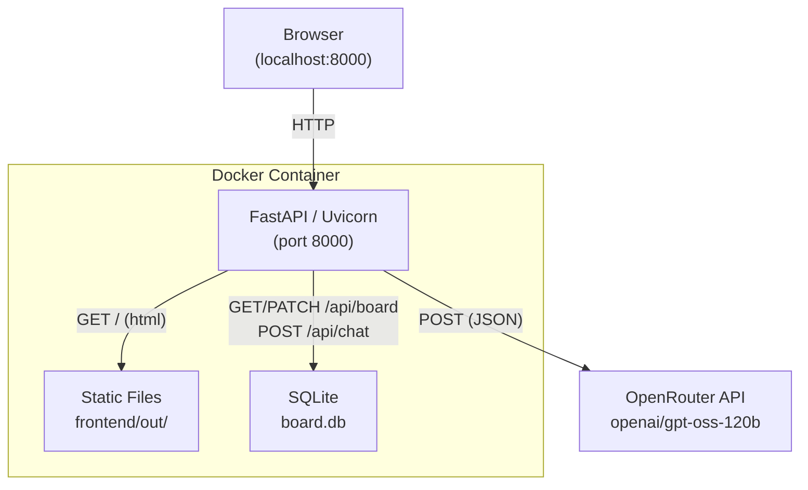
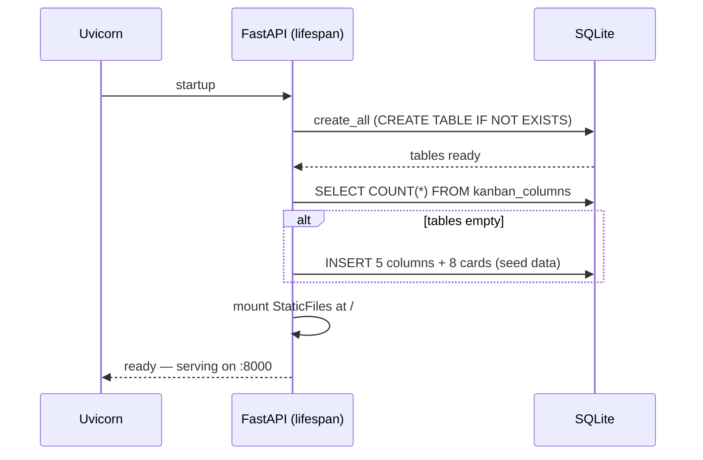
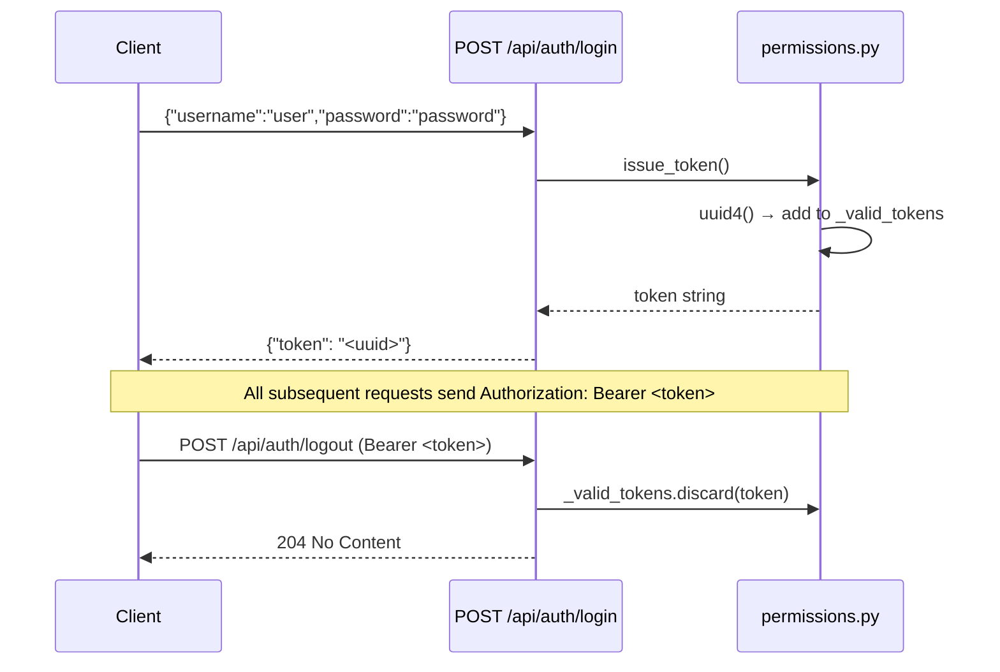
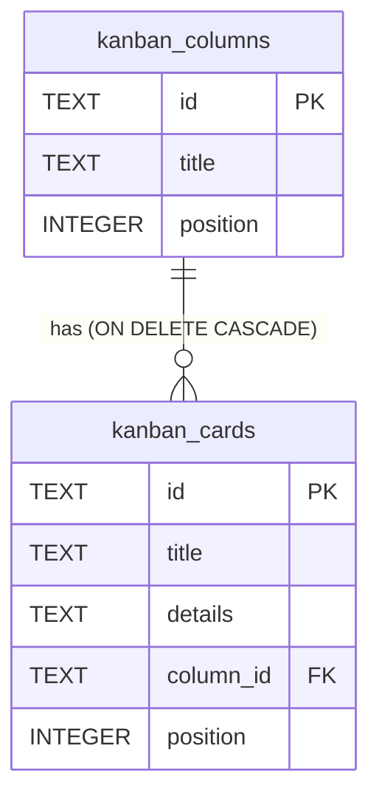
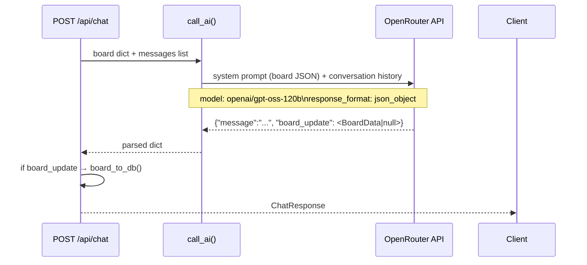
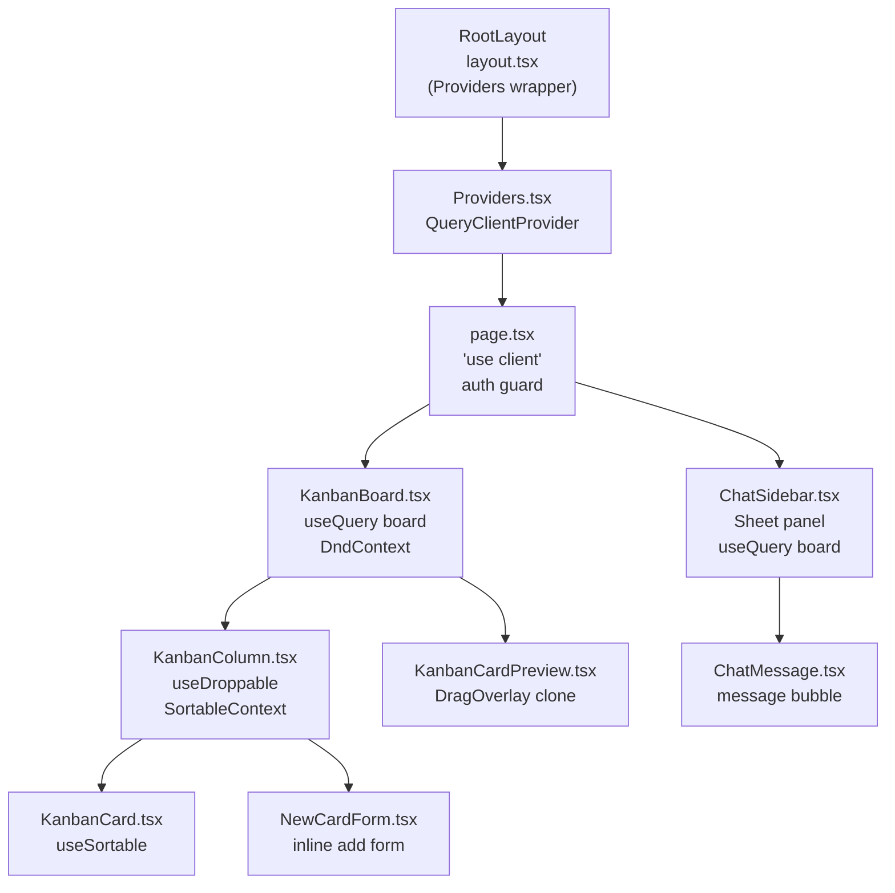
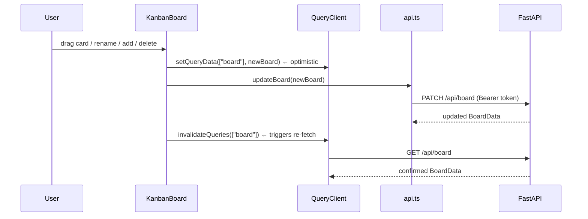
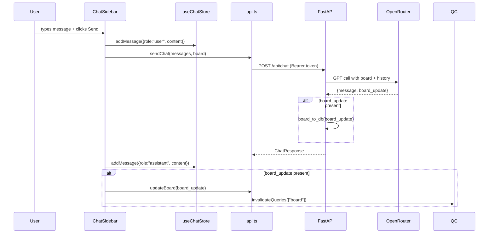
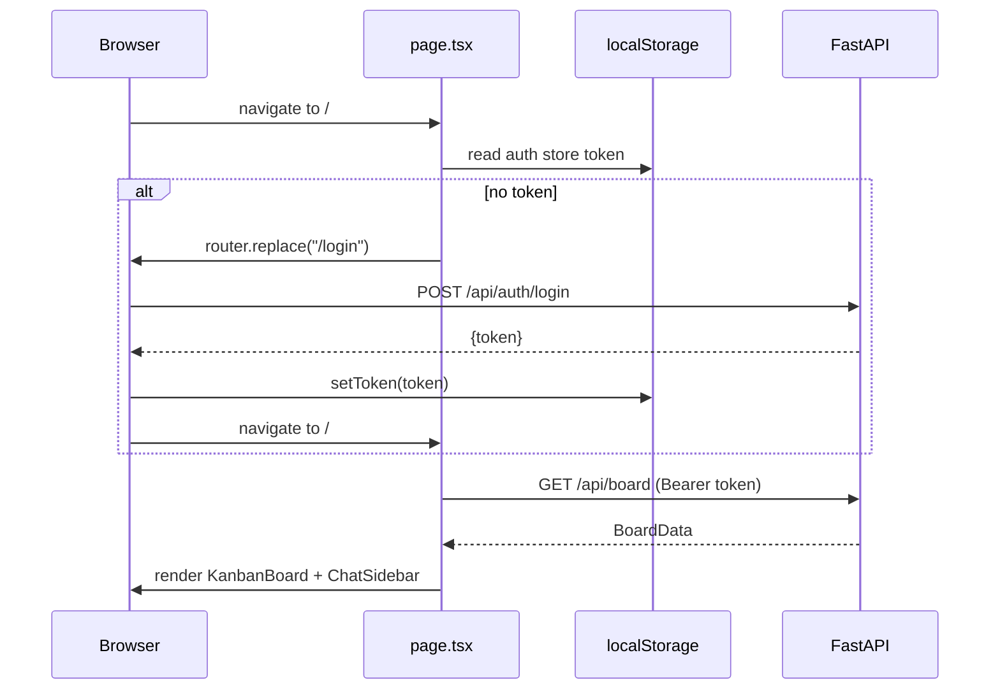
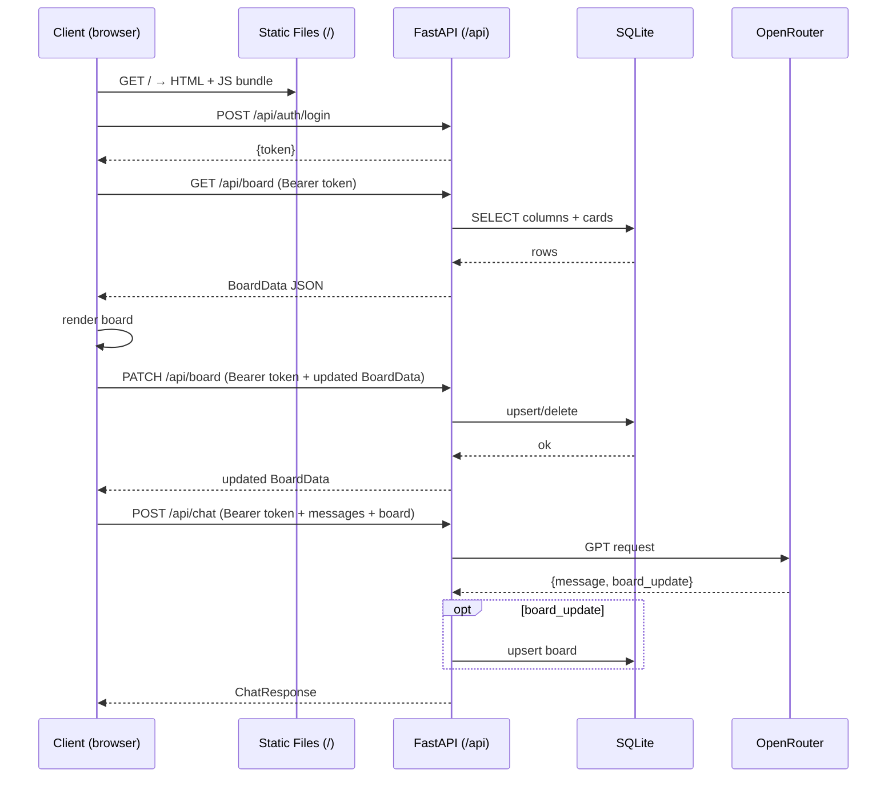

# System Architecture

## Overview

Agentic-PM is a single-board Kanban app with an AI chat sidebar. The entire stack runs in one Docker container: a FastAPI server that serves the statically-built Next.js frontend at `/` and exposes a REST API at `/api/*`. State is persisted in a SQLite database. AI features are powered by OpenRouter.

```
Browser → Docker container (port 8000)
              └── FastAPI
                    ├── /           → serves Next.js static export (frontend/out/)
                    ├── /api/*      → REST API
                    └── board.db    → SQLite (auto-created on startup)
                              ↕
                        OpenRouter API (AI)
```

---

## Deployment Layout



The Dockerfile uses a two-stage build:

- **Stage 1** (`oven/bun:1`) — installs frontend deps and runs `bun run build`, producing `frontend/out/` (static HTML/JS/CSS)
- **Stage 2** (`python:3.12-slim`) — installs backend with `uv sync`, copies `frontend/out/` in, starts uvicorn

---

## Backend Architecture

### Module Structure

```
backend/app/
  main.py            # FastAPI app, router registration, lifespan, static mount
  config.py          # Reads DATABASE_URL and OPENROUTER_API_KEY from .env
  database.py        # Async SQLAlchemy engine, session factory, init_db(), seed_db()
  ai.py              # OpenRouter client, call_ai()
  auth/
    permissions.py   # In-memory token store, issue_token(), require_auth dependency
  models/
    board.py         # ORM models (KanbanColumn, KanbanCard)
                     # Pydantic schemas (BoardData, CardSchema, ColumnSchema)
                     # Pydantic chat schemas (ChatMessage, ChatRequest, ChatResponse)
                     # db_to_board(), board_to_db()
  routes/
    auth.py          # POST /api/auth/login, POST /api/auth/logout
    board.py         # GET /api/board, PATCH /api/board
    chat.py          # POST /api/chat
```

### Startup Sequence



### Authentication

Auth is **stateless from the client's perspective** but **in-memory on the server**. Tokens are UUID4 strings stored in a Python `set[str]` for the lifetime of the process. They are not persisted to the database — a server restart invalidates all sessions.



`require_auth` is a FastAPI dependency injected on every protected route. It reads the `Authorization` header, strips `Bearer `, and checks the token against `_valid_tokens`. Returns 401 if absent or invalid.

### Database Layer

SQLite file (`board.db`) lives in `backend/`. SQLAlchemy async engine with `aiosqlite` driver. All DB I/O is non-blocking.



**`db_to_board(session) → BoardData`** — queries all columns ordered by `position`, all cards ordered by `position`, builds the `BoardData` JSON structure the frontend expects.

**`board_to_db(session, board)`** — diff-based upsert: deletes removed column/card IDs, then INSERT-or-UPDATE the rest. Positions are derived from array index order.

### API Routes

| Method  | Path               | Auth | Description                                                  |
| ------- | ------------------ | ---- | ------------------------------------------------------------ |
| `GET`   | `/api/health`      | No   | Health check → `{"status":"ok"}`                             |
| `POST`  | `/api/auth/login`  | No   | Validates credentials, returns token                         |
| `POST`  | `/api/auth/logout` | Yes  | Invalidates token, returns 204                               |
| `GET`   | `/api/board`       | Yes  | Returns full `BoardData` from DB                             |
| `PATCH` | `/api/board`       | Yes  | Accepts `BoardData`, persists, returns updated state         |
| `POST`  | `/api/chat`        | Yes  | Accepts messages + board, calls AI, optionally updates board |

### AI Layer (`ai.py`)



The system prompt embeds the full board JSON so the model has complete context. The model is instructed to return only valid JSON with `message` (string) and `board_update` (BoardData or null).

---

## Frontend Architecture

### Technology Stack

| Concern         | Library                                      |
| --------------- | -------------------------------------------- |
| Framework       | Next.js 16 (static export)                   |
| Language        | TypeScript + React 19                        |
| Styling         | Tailwind CSS v4 + CSS custom properties      |
| UI components   | shadcn/ui (Sheet, Button, Input, ScrollArea) |
| Drag and drop   | @dnd-kit/core + @dnd-kit/sortable            |
| Server state    | TanStack Query v5                            |
| Client state    | Zustand v5                                   |
| Package manager | bun                                          |

### Component Tree



### State Management

There are two state domains, kept separate:

**Server state** (TanStack Query, key: `["board"]`):

- Single source of truth for `BoardData`
- Fetched on mount via `GET /api/board`
- Optimistically updated via `setQueryData` then confirmed with `invalidateQueries` after any mutation
- Used by both `KanbanBoard` and `ChatSidebar`

**Client state** (Zustand):

| Store | File          | Contents                                                 |
| ----- | ------------- | -------------------------------------------------------- |
| Auth  | `lib/auth.ts` | `token: string \| null` — persisted to `localStorage`    |
| Chat  | `lib/chat.ts` | `messages: ChatMessage[]` — session only (not persisted) |

### Data Flow — Board Mutation



### Data Flow — AI Chat



### Auth Flow



### Data Model (`lib/kanban.ts`)

```
BoardData
  columns: Column[]        ← ordered array drives column render order
    id: string
    title: string
    cardIds: string[]      ← ordered, drives card render order within column
  cards: Record<id, Card>  ← flat lookup map
    id: string
    title: string
    details: string
```

Cards are normalised — `cards` is a flat map keyed by ID, and columns only hold ordered arrays of IDs. `moveCard()` is a pure function that handles both same-column reorder and cross-column moves, returning a new `columns` array without mutating state.

---

## Request Authentication Sequence (Full)



---

## Cross-Cutting Constraints

| Constraint             | Detail                                                                                                |
| ---------------------- | ----------------------------------------------------------------------------------------------------- |
| Static export          | Next.js `output: "export"` — no server-side rendering, all API calls are client-side `fetch`          |
| No hardcoded colors    | All colors reference CSS custom properties (`--navy-dark`, `--primary-blue`, etc.) from `globals.css` |
| Single auth credential | Hardcoded `user` / `password`; tokens are in-memory, not persisted across restarts                    |
| Zero migration step    | `init_db()` runs on every startup; tables are created and seeded automatically                        |
| Package managers       | `bun` for frontend only, `uv` for backend only — never mixed                                          |
| AI model               | `openai/gpt-oss-120b` via OpenRouter's OpenAI-compatible API                                          |
| Token storage          | `localStorage` via Zustand `persist` middleware; cleared on logout                                    |
